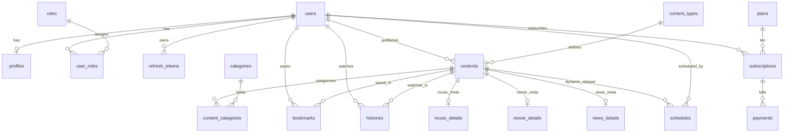

# Backend Update Complete ✅

## Status: Fully Ready & Operational 🚀

The backend system is completely updated, synchronized with the production-ready 18-table relational PostgreSQL schema, and fully implemented with all necessary services, models, routes, and controllers.

---

## 📂 File Architecture Status

All **18 Models** and **12 Controllers** have been successfully created, reviewed, syntax-validated, and verified to run without any errors.

### 🔑 Authentication & Access (5 Models / 2 Controllers)
* **User Model (`userModel.js`)** — Account registration, credential updates.
* **Profile Model (`profileModel.js`)** — Direct user profile CRUD.
* **Role Model (`roleModel.js`)** — Roles storage (admin, user, moderator).
* **UserRole Model (`userRoleModel.js`)** — Junction mapping users to roles.
* **RefreshToken Model (`refreshTokenModel.js`)** — Cryptographic bcrypt-hashed JWT refresh storage.
* **Auth Controller (`authController.js`)** — Token rotation, reuse detection.
* **Role Controller (`roleController.js`)** [NEW] — Complete CRUD for roles and user-role assignment.

### 🎬 Content Management & Details (5 Models / 4 Controllers)
* **Content Model (`contentModel.js`)** — Multi-status content storage (`draft`, `published`, `scheduled`, `archived`) with views tracking and soft-delete capabilities.
* **ContentType Model (`contentTypeModel.js`)** — Content type taxonomy (Music, Movie, News).
* **Category Model (`categoryModel.js`)** — Group categories (Pop, Action, Technology).
* **ContentCategory Model (`contentCategoryModel.js`)** — Junction table mapping contents to categories.
* **MusicDetails, MovieDetails, NewsDetails Models** — Metadata storage specific to each type.
* **Content Controller (`contentController.js`)** — Multi-status listing, views, and categories management.
* **Category Controller (`categoryController.js`)** [NEW] — CRUD endpoints for managing categories.
* **ContentType Controller (`contentTypeController.js`)** [NEW] — CRUD endpoints for managing content types.
* **ContentDetail Controller (`contentDetailController.js`)** [NEW] — Auto-resolves type details under a single unified endpoints pipeline.

### 💳 Plans, Subscriptions & Payments (3 Models / 3 Controllers)
* **Plan Model (`planModel.js`)** — Plan durations, prices, and active state management.
* **Subscription Model (`subscriptionModel.js`)** — Lifecycles (`pending`, `active`, `expired`, `canceled`).
* **Payment Model (`paymentModel.js`)** — Transaction states (`pending`, `paid`, `failed`, `refunded`).
* **Plan Controller (`planController.js`)** — Plan list and customization.
* **Subscription Controller (`subscriptionController.js`)** — Auto-dates calculation and cancellations.
* **Payment Controller (`paymentController.js`)** — Processing payments and activating subscriptions.

### 📅 Engagement & Scheduling (3 Models / 3 Controllers)
* **Bookmark Model (`bookmarkModel.js`)** & **Bookmark Controller (`bookmarkController.js`)** — Quick saved bookmarks with full categories aggregates.
* **History Model (`historyModel.js`)** & **History Controller (`historyController.js`)** — Watching history tracks, watch-time, and clears.
* **Schedule Model (`scheduleModel.js`)** & **Schedule Controller (`scheduleController.js`)** — Time scheduling and weekly recurrence.

---

## 🚀 Setup Instructions

### 1. Install Dependencies
```bash
npm install
```

### 2. Configure Environment Variables (`.env`)
Create a `.env` file in the root directory:
```env
DB_USER=postgres
DB_HOST=localhost
DB_NAME=daily_entertainment
DB_PASSWORD=your_password
DB_PORT=5432
NODE_ENV=development
JWT_SECRET=your_jwt_secret_key_here
JWT_REFRESH_SECRET=your_refresh_secret_key_here
PORT=5000
```

### 3. Initialize PostgreSQL Database
Deploy the complete schema directly from [database/schema.sql](file:///c:/Dicky%20File/Celerates/Backend/BackEnd/database/schema.sql) and populate it with standard seed data:
```bash
# Set up tables
psql -U postgres -d daily_entertainment -f database/schema.sql

# Seed initial roles, types, categories, and subscription plans
psql -U postgres -d daily_entertainment -f INIT_DATA.sql
```

### 4. Start Local Development Server
```bash
npm run dev
# or direct startup:
node server.js
```

---

## 📝 Complete Testing Checklist (Postman / HTTP Client)

### 1. Authentication & Roles
- [x] `POST /api/register` — Standard registration (assigns "user" role)
- [x] `POST /api/login` — Retrieves tokens (access token & cookie-based refresh token)
- [x] `POST /api/refresh` — Rotates tokens with automatic reuse detection
- [x] `POST /api/logout` — Destroys refresh token session
- [x] `GET /api/roles` — Retrieves all roles (Admin only)
- [x] `POST /api/roles/assign` — Assigns a role to a user (Admin only)
- [x] `POST /api/roles/remove` — Revokes a role from a user (Admin only)

### 2. Contents & Metadata
- [x] `POST /api/contents` — Generates a draft/published content item
- [x] `GET /api/contents` — Retrieves filtered list (by contentTypeId, status, etc.)
- [x] `GET /api/contents/:id` — Gets detailed view (automatically increments `views_count`)
- [x] `PUT /api/contents/:id` — Modifies general content
- [x] `DELETE /api/contents/:id` — Performs soft or hard deletion
- [x] `POST /api/contents/:contentId/details` — Adds Music, Movie, or News detail (auto-resolved)
- [x] `GET /api/contents/:contentId/details` — Fetches type-specific details
- [x] `PUT /api/contents/:contentId/details` — Modifies type-specific details

### 3. Categories & Content Types
- [x] `POST /api/categories` — Creates content category (Admin only)
- [x] `GET /api/categories` — Lists all categories
- [x] `POST /api/contents/category` — Appends category to a content item
- [x] `DELETE /api/contents/category` — Detaches category from a content item
- [x] `POST /api/content-types` — Creates content type (Admin only)
- [x] `GET /api/content-types` — Lists all types

### 4. Bookmarks & History
- [x] `POST /api/bookmarks` — Bookmarks content
- [x] `GET /api/bookmarks` — Fetches user's bookmarked contents with categories
- [x] `GET /api/bookmarks/:contentId` — Check bookmark status of content
- [x] `DELETE /api/bookmarks/:contentId` — Unbookmarks content
- [x] `POST /api/histories` — Tracks watch history
- [x] `GET /api/histories` — Fetches watch history list
- [x] `DELETE /api/histories` — Clears watch history

### 5. Plans & Subscriptions
- [x] `POST /api/plans` — Creates a plan (Admin only)
- [x] `GET /api/plans` — Lists active plans
- [x] `POST /api/subscriptions` — Initiates standard user subscription (starts as `pending`)
- [x] `GET /api/subscriptions/active` — Gets current active plan
- [x] `PUT /api/subscriptions/:id/cancel` — Cancels plan renew state

### 6. Payments & Billing
- [x] `POST /api/payments` — Creates payment invoice associated with subscription
- [x] `POST /api/payments/:id/pay` — Simulates successful payment, sets subscription state to `active`
- [x] `PUT /api/payments/:id/refund` — Marks as refunded, sets subscription to `canceled` (Admin only)

### 7. Schedules & Recurrence
- [x] `POST /api/schedules` — Creates scheduling timer (weekly/one-time)
- [x] `GET /api/schedules` — Lists active schedules
- [x] `GET /api/schedules/content/:contentId` — Schedules filtered by content
- [x] `PUT /api/schedules/:id` — Updates schedule timing

---

## 📊 Complete Model Relationship Flowchart



---

## ✨ Features Ready for Production

* **JWT Authenticated Access** — Secure stateless sessions with automatic 7-day refresh tokens storage.
* **Cryptographic Tokens Safeguard** — Access tokens expire in 15 minutes, refresh tokens are hashed with bcrypt.
* **Token Abuse Detection** — Instantly invalidates all sessions if refresh token duplication/reuse is detected.
* **Dual Roles Defense** — Middleware handles granular role checking (`authorizeRoles('admin', 'moderator')`).
* **Relational Multi-Type Content** — Unified routes pipeline handles specific Music, Movie, news categories without ad-hoc endpoints.
* **Subscription State Machine** — Full cycle transition: pending payment ➡️ active ➡️ canceled/expired.
* **Auto View Accumulation** — Retrieving content increments `views_count` atomic-level.
* **Soft Deletes Audit Trail** — Standard delete keeps items in database with `deleted_at` timestamp.
